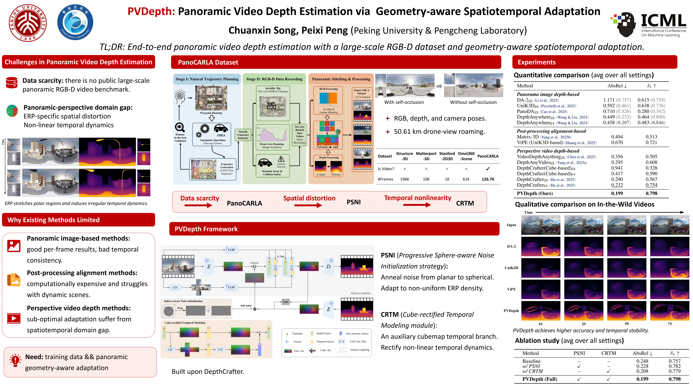

<div align="center">
<h1>PVDepth: Panoramic Video Depth Estimation via Geometry-Aware Spatiotemporal Adaptation</h1>


<a href="https://openreview.net/pdf?id=HwYgnZjxUB"></a>
<a href="https://huggingface.co/datasets/Soon122/PanoCARLA"></a>
<a href="https://huggingface.co/Soon122/PVDepth"></a>

<a href="https://scholar.google.com/citations?user=NhZxUX0AAAAJ&hl=zh-CN">Chuanxin Song</a>,
<a href="https://scholar.google.com/citations?user=CFMuFGoAAAAJ&hl=zh-CN">Peixi Peng</a>
</div>

🤗 If you find **PVDepth** or **PanoCARLA** useful, **please help ⭐ this repo**, which is important to open-source projects. Thanks!

## Introduction

We introduce **[PanoCARLA](https://huggingface.co/datasets/Soon122/PanoCARLA)**, a large-scale synthetic RGB-D panoramic video dataset, and **PVDepth**, a generative framework for panoramic video depth estimation. By addressing ERP-specific spatial distortions and temporal non-linear dynamics, PVDepth produces accurate and temporally consistent depth sequences.

## Poster

<p align="center">
  
</p>

## Checklist / TODOs

- [x] Release the PanoCARLA dataset
- [x] Release the training code and evaluation scripts
- [x] Release the model weights
- [ ] Open-source the panoramic data collection pipeline

## Installation

```bash
git clone https://github.com/ChuanxinSong/PVDepth.git
cd PVDepth

conda create -n pvdepth python=3.10 -y
conda activate pvdepth

pip install torch==2.6.0 torchvision==0.21.0 torchaudio==2.6.0 \
  --index-url https://download.pytorch.org/whl/cu124
pip install -r requirements.txt
```

## Quick Start

`run_infer_any.sh` supports a single image, an image folder, or a video as input. For example:

```bash
GPU_ID=0 bash run_infer_any.sh examples/200035.mp4
```

The output directory contains the relative inverse-depth prediction as a NumPy
file and a PNG or MP4 visualization.

Processing a 110-frame video at 1024 × 512 resolution requires approximately
31 GB of GPU memory. If GPU memory is insufficient, set `CPU_OFFLOAD` in
`run_infer_any.sh` to `model`, or use `sequential` for a further substantial
reduction to approximately 10 GB of GPU memory. Sequential CPU offloading is
considerably slower.

### Model Checkpoint

The default checkpoint, [Soon122/PVDepth](https://huggingface.co/Soon122/PVDepth),
is downloaded automatically on first use. To use a manually downloaded or
custom checkpoint, pass its UNet directory as the second argument:

```bash
GPU_ID=0 bash run_infer_any.sh <input_path> path/to/unet [output_dir]
```

## Dataset

The [PanoCARLA dataset](https://huggingface.co/datasets/Soon122/PanoCARLA) is available on Hugging Face.

Download the dataset with the Hugging Face CLI:

```bash
hf auth login
hf download Soon122/PanoCARLA \
  --repo-type dataset \
  --local-dir path/to/PanoCARLA

tar -xf path/to/PanoCARLA/town0210_res1024_512.tar \
  -C path/to/PanoCARLA
```

For training, set `data_root` to `path/to/PanoCARLA` and `h5_data_root` to
`path/to/PanoCARLA/panocarla_h5`.

```bash
cp paths.example.env paths.env
```

Update the paths in `paths.env` before starting training.

## Training

PVDepth uses a two-stage training procedure:

1. Run Stage 1 to adapt the model to the sphere-aware noise input introduced
   by PSNI:

   ```bash
   bash train_stage1_psni.sh
   ```

2. Set `UNET_PATH` in `train_stage2_pvdepth.sh` to the Stage 1 UNet checkpoint.

3. Run Stage 2:

   ```bash
   bash train_stage2_pvdepth.sh
   ```

## Benchmark Evaluation

First, run inference on the Town02/Town10 benchmark with the default PVDepth
checkpoint:

```bash
bash run_infer_town0210.sh
```

Then evaluate the generated predictions:

```bash
bash depth_eval/run_eval.sh
```

Evaluation CSV files are saved to `depth_eval/results/pvdepth` by default.
Common settings can be overridden with environment variables:

```bash
GPU_ID=1 \
PRED_BASE_DIR=path/to/predictions \
OUTPUT_DIR=path/to/evaluation_results \
bash depth_eval/run_eval.sh
```

To evaluate a custom checkpoint, set `UNET_PATH` and `OUTPUT_ROOT_DIR` in
`run_infer_town0210.sh`, run inference, and pass the matching output directory
through `PRED_BASE_DIR`.

### Evaluation Protocol Update (2026.09.10)

We fixed a numerical instability in the PanoCARLA depth-evaluation pipeline.
The scale-and-shift alignment is performed in disparity space, where the
aligned disparity can cross or approach zero. Taking its reciprocal can then
produce extremely large predicted depths and disproportionately affect
unbounded metrics such as Abs Rel, Sq Rel, and RMSE.

The evaluator now supports two protocols:

- `bounded` (default) lower-bounds aligned disparity by `1 / max_depth` before
  inversion, then clips predicted depth to `[min_depth, max_depth]`.
- `legacy` preserves the behavior of the originally released evaluator and
  should be used to reproduce the evaluation protocol of the paper results.

The default PanoCARLA evaluation range is `[0.1, 80]` meters. Both protocols
use exactly the same per-clip LAD2 scale-and-shift alignment; they differ only
in the aligned-disparity-to-depth conversion. Results from different protocols
should not be compared without explicitly identifying the protocol.

Run the corrected default protocol with:

```bash
bash depth_eval/run_eval.sh
```

Run the legacy protocol with:

```bash
EVAL_PROTOCOL=legacy bash depth_eval/run_eval.sh
```

The following results use the original paper's PVDepth inference outputs, the
default LAD2 settings (`lr=1e-4`, `max_iters=1000`), and the
`0.1 < depth < 80` ground-truth validity mask:

| Split | Protocol | Abs Rel | Sq Rel | RMSE | Log RMSE | &delta;<sub>1</sub> |
|---|---|---:|---:|---:|---:|---:|
| dynamic_fps02_len50 | legacy | 0.211 | 4.683 | 8.949 | 0.257 | 0.789 |
| dynamic_fps02_len50 | bounded | 0.203 | 2.167 | 6.691 | 0.251 | 0.790 |
| dynamic_fps10_len90 | legacy | 0.204 | 841.520 | 50.292 | 0.271 | 0.787 |
| dynamic_fps10_len90 | bounded | 0.189 | 1.802 | 6.109 | 0.234 | 0.789 |
| dynamic_fps20_len110 | legacy | 0.181 | 2340.891 | 54.791 | 0.242 | 0.818 |
| dynamic_fps20_len110 | bounded | 0.163 | 1.479 | 5.859 | 0.216 | 0.819 |

We thank **Qimo** for identifying and carefully diagnosing this issue.

## Visualization Comparison

The center panel shows the input panoramic video, while the surrounding panels
compare depth predictions from PVDepth (top left), ViPE (top right), DA-2
(bottom left), and UniK3D (bottom right). PVDepth produces stable and
temporally consistent depth predictions throughout the video.

https://github.com/user-attachments/assets/4edbc5f8-fd76-42f8-bcf8-7ed343957ad8

If the embedded video does not play, you can [view or download the video directly](asset/vis_video_comparison.mp4).

## Limitations

- **Specular reflections.** PVDepth struggles with strongly reflective
  surfaces, such as the water scene at approximately 00:42 in the comparison
  video. Existing depth models also produce invalid or implausible predictions
  in this case, indicating that strong specular reflections remain a shared
  challenge for current depth estimation methods.
- **Indoor evaluation.** PanoCARLA contains only outdoor scenes. Although
  PVDepth produces visually reasonable results on the indoor examples shown in
  the video, we have not conducted quantitative evaluation on indoor datasets.

## Acknowledgements

Our implementation builds upon excellent open-source projects, including but not limited to [DepthCrafter](https://github.com/Tencent/DepthCrafter), [SVD_Xtend](https://github.com/pixeli99/SVD_Xtend), and [Diffusers](https://github.com/huggingface/diffusers).

## Citation

If you find this repository helpful, please consider citing:

```bibtex
@inproceedings{song2026pvdepth,
  author    = {Song, Chuanxin and Peng, Peixi},
  title     = {PVDepth: Panoramic Video Depth Estimation via Geometry-Aware Spatiotemporal Adaptation},
  booktitle = {ICML},
  year      = {2026}
}
```

## License

PVDepth is released primarily for academic research. Components derived from DepthCrafter remain subject to the original DepthCrafter license.

See [LICENSE](LICENSE) and [LICENSE-PVDEPTH](LICENSE-PVDEPTH) for details.
